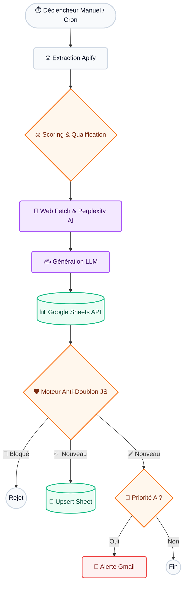

```mermaid
flowchart TD
    A([⏱️ Déclencheur Manuel / Cron]) --> B[🌐 Extraction Apify]
    B --> C{⚖️ Scoring & Qualification}
    C --> D[🧠 Web Fetch & Perplexity AI]
    D --> E[✍️ Génération LLM]
    E --> F[(📊 Google Sheets API)]
    F --> G{🛡️ Moteur Anti-Doublon JS}

    G -- "🛑 Bloqué" --> Z((Rejet))
    G -- "✅ Nouveau" --> H[(💾 Upsert Sheet)]
    G -- "✅ Nouveau" --> I{🎯 Priorité A ?}
    
    I -- "Oui" --> J[📧 Alerte Gmail]
    I -- "Non" --> K((Fin))

    classDef default fill:#f8fafc,stroke:#cbd5e1,stroke-width:2px,color:#0f172a,rx:5px,ry:5px;
    classDef database fill:#ecfdf5,stroke:#10b981,stroke-width:2px,color:#064e3b;
    classDef ai fill:#f3e8ff,stroke:#a855f7,stroke-width:2px,color:#3b0764;
    classDef logic fill:#fff7ed,stroke:#f97316,stroke-width:2px,color:#7c2d12;
    classDef mail fill:#fef2f2,stroke:#ef4444,stroke-width:2px,color:#7f1d1d;
    
    class F,H database;
    class D,E ai;
    class C,G,I logic;
    class J mail;
```